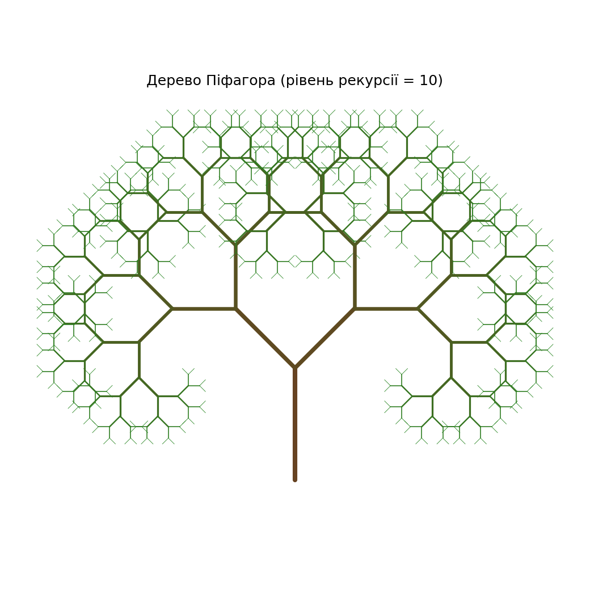
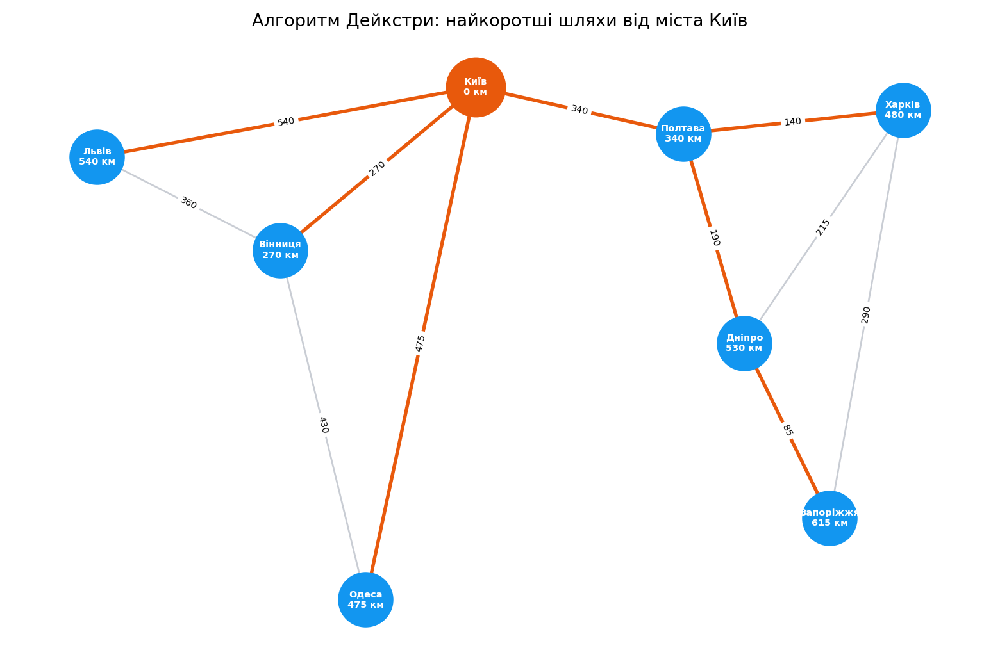
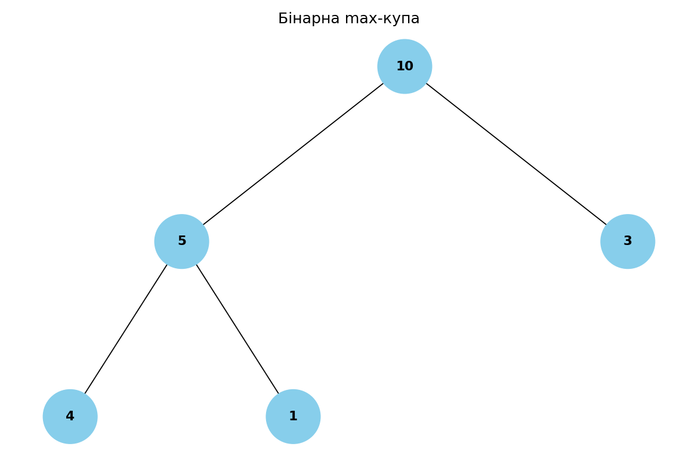
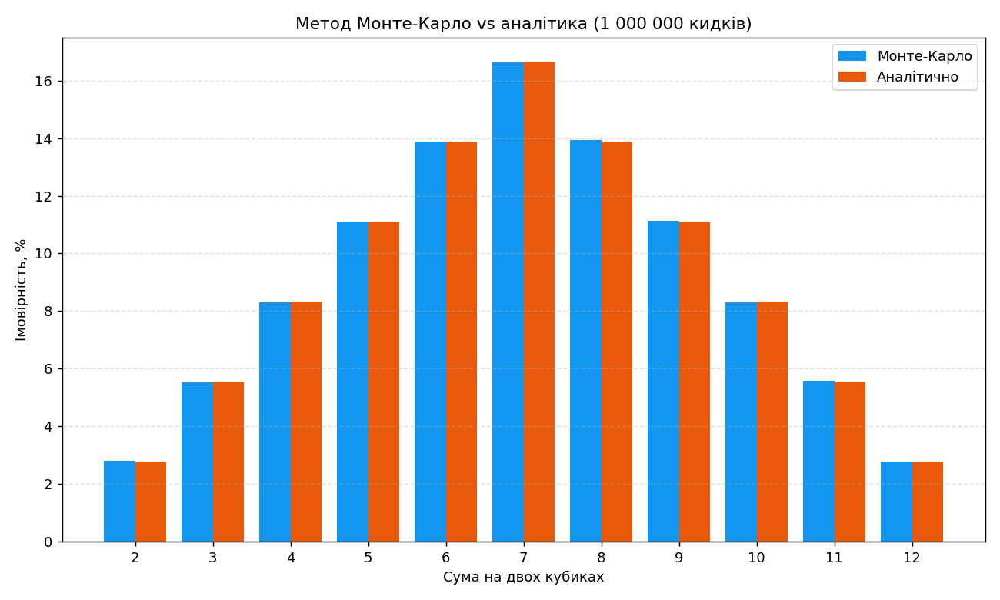

# goit-algo-fp

[](https://github.com/MarynaShavlak/goit-algo-fp/actions/workflows/ci.yml)
[](https://www.python.org/)
[](LICENSE)

Фінальний проєкт курсу з алгоритмів і структур даних. Кожна задача — в окремій
теці `task_N`, із власним `README.md` та кодом.

## Структура

```
goit-algo-fp/
├── README.md          
├── LICENSE            # MIT
├── pyproject.toml     # метадані пакета + editable-встановлення (viz)
├── requirements.txt   # залежності візуалізації (networkx, matplotlib)
├── viz/               # код візуалізації
│   ├── __init__.py        # робить viz пакетом
│   ├── colors.py          # lerp_color — спільний градієнт  (task_2, task_5)
│   ├── pythagoras.py      # render_turtle + save_png        (task_2)
│   ├── dijkstra_graph.py  # draw_graph + animate_dijkstra   (task_3)
│   ├── binary_tree.py     # Node + draw_tree + animate       (task_4, task_5)
│   ├── dice_chart.py      # draw_chart                      (task_7)
│   ├── anim.py            # save_gif — складання GIF-анімацій
│   └── bench.py           # графіки бенчмарків              (task_1, task_6)
├── tests/             # pytest-тести
├── task_1/            # Структури даних, сортування (однозв'язний список)
│   ├── main.py        # reverse + insertion/merge sort + merge_sorted_ll
│   ├── sort_timing.png     # бенчмарк insertion vs merge (--bench)
│   └── README.md
├── task_2/            # Рекурсія: фрактал «дерево Піфагора»
│   ├── main.py        # pythagoras_segments (рекурсія) + демо
│   ├── tree.png       # прев'ю рівня 10 (генерується `--save`)
│   ├── tree_l{2,4,6,8}.png  # прев'ю менших рівнів для галереї
│   └── README.md
├── task_3/            # Дерева, алгоритм Дейкстри
│   ├── main.py        # dijkstra (heapq) + dijkstra_steps + reconstruct_path
│   ├── dijkstra.png   # дерево найкоротших шляхів (--save)
│   ├── dijkstra.gif   # покрокова анімація фронтиру (--animate)
│   └── README.md
├── task_4/            # Візуалізація бінарної купи
│   ├── main.py        # build_heap_tree (2i+1 / 2i+2)
│   ├── min_heap.png   # прев'ю min-купи (генерується `--save`)
│   ├── max_heap.png   # прев'ю max-купи (генерується `--save`)
│   └── README.md
├── task_5/            # Візуалізація обходу бінарного дерева
│   ├── main.py        # DFS/BFS (стек і черга) + розфарбування
│   ├── dfs.png        # прев'ю DFS-обходу (--save)
│   ├── bfs.png        # прев'ю BFS-обходу (--save)
│   ├── dfs.gif        # анімація DFS-обходу (--animate)
│   ├── bfs.gif        # анімація BFS-обходу (--animate)
│   └── README.md
├── task_6/            # Жадібні алгоритми та динамічне програмування
│   ├── main.py        # greedy + dynamic_programming(_value)
│   ├── knapsack_compare.png  # бенчмарк greedy vs ДП (--bench)
│   └── README.md
└── task_7/            # Метод Монте-Карло
    ├── main.py        # monte_carlo_dice + порівняння з аналітикою
    ├── dice.png       # графік Монте-Карло vs аналітика
    └── README.md
```

> Увесь код візуалізації (turtle / matplotlib / networkx) зібрано в пакеті `viz`,
> щоб `main.py` кожної задачі лишався чистим — лише алгоритм і демонстрація.

## Задачі

| № | Тема | Опис |
|---:|---|---|
| 1 | Структури даних, сортування (однозв'язний список) | Реверс (зміна посилань), сортування вставками та злиття двох відсортованих списків. [Деталі](task_1/README.md) |
| 2 | Рекурсія: фрактал «дерево Піфагора» | Рекурсивна побудова дерева Піфагора (`turtle`) із заданим рівнем рекурсії. [Деталі](task_2/README.md) |
| 3 | Дерева, алгоритм Дейкстри | Найкоротші шляхи у зваженому графі через бінарну купу (`heapq`) + відновлення маршрутів. [Деталі](task_3/README.md) |
| 4 | Візуалізація бінарної купи | Побудова дерева з масиву-купи (`2i+1` / `2i+2`) та його візуалізація. [Деталі](task_4/README.md) |
| 5 | Візуалізація обходу бінарного дерева | Ітеративні DFS/BFS (стек і черга) з розфарбуванням вузлів градієнтом за порядком обходу. [Деталі](task_5/README.md) |
| 6 | Жадібні алгоритми та динамічне програмування | Вибір страв з максимальною калорійністю в межах бюджету (рюкзак 0/1). [Деталі](task_6/README.md) |
| 7 | Метод Монте-Карло | Симуляція кидків двох кубиків, ймовірності сум і порівняння з аналітикою. [Деталі](task_7/README.md) |

## Галерея

Прев'ю генеруються самим кодом (`--save`) — деталі див. у [Відтворенні картинок](#відтворення-картинок).

<table>
  <tr>
    <td align="center" width="33%">
      <br>
      <sub><b>task_2</b> · фрактал «дерево Піфагора»</sub>
    </td>
    <td align="center" width="33%">
      <br>
      <sub><b>task_3</b> · найкоротші шляхи (Дейкстра)</sub>
    </td>
    <td align="center" width="33%">
      <br>
      <sub><b>task_4</b> · бінарна купа (max-heap)</sub>
    </td>
  </tr>
  <tr>
    <td align="center" width="33%">
      <br>
      <sub><b>task_5</b> · обхід дерева (BFS)</sub>
    </td>
    <td align="center" width="33%">
      <br>
      <sub><b>task_7</b> · Монте-Карло (сума двох кубиків)</sub>
    </td>
    <td width="33%"></td>
  </tr>
</table>

## Запуск

Потрібен **Python 3.10+** (як задано в `requires-python` у `pyproject.toml`).

Спільний код візуалізації лежить у пакеті `viz`, тож перед графічними задачами
необхідно встановити проєкт у editable-режимі — це підтягне `networkx` + `matplotlib` і
зробить `viz` імпортованим звідусіль:

```bash
pip install -e .
```

Після цього кожну задачу можна запускати окремо:

```bash
python task_6/main.py
```

`task_1` і `task_6` працюють без встановлення — лише стандартна бібліотека.
Задачі з візуалізацією (`task_2`–`task_5`, `task_7`) потребують залежностей із
`requirements.txt`; `task_2` ще й використовує стандартний `turtle`, тож для
інтерактивного вікна потрібне графічне середовище.

### Тести

```bash
pip install -e ".[dev]"   # додатково ставить pytest
pytest
```

### Відтворення картинок

PNG у репозиторії генеруються самим кодом — прапорцем `--save`:

```bash
python task_2/main.py --save     # tree.png
python task_3/main.py --save     # dijkstra.png
python task_4/main.py --save     # min_heap.png, max_heap.png
python task_5/main.py --save     # dfs.png, bfs.png
python task_7/main.py --save     # dice.png
```

Анімації та бенчмарки (потрібен `matplotlib`):

```bash
python task_3/main.py --animate  # dijkstra.gif (фронтир Дейкстри)
python task_5/main.py --animate  # dfs.gif, bfs.gif
python task_1/main.py --bench    # sort_timing.png (insertion vs merge)
python task_6/main.py --bench    # knapsack_compare.png (greedy vs ДП)
```

## Ліцензія

[MIT](LICENSE) © Maryna Shavlak
