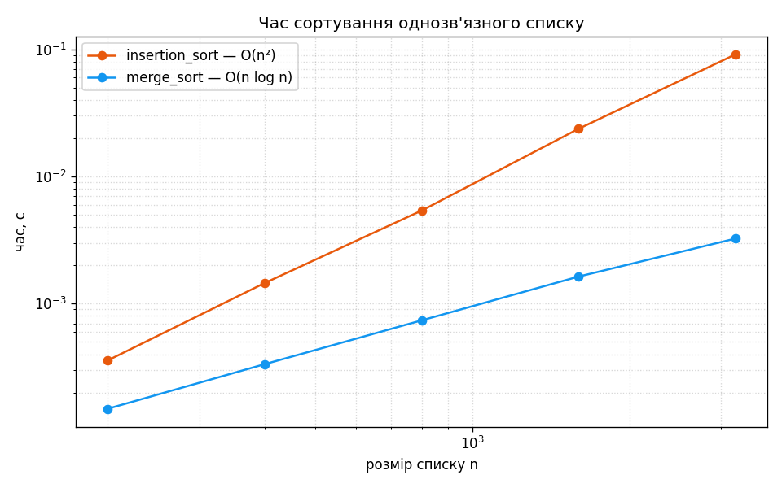

# Завдання 1 — Однозв'язний список: реверс, сортування, злиття

Операції над однозв'язним списком: реверс, два сортування (вставками й злиттям)
та злиття двох уже відсортованих списків в один.

## Запуск

```bash
python task_1/main.py
```

Лише стандартна бібліотека.

## Як це працює

`reverse` проходить список один раз і розвертає посилання `next` кожного вузла на
попередній; новим `head` стає колишній хвіст. O(n), O(1) пам'яті, без створення
нових вузлів.

`insertion_sort` будує окремий відсортований ланцюг, переставляючи самі вузли, а
не значення. Тут і ховається головна тонкість: якщо орієнтуватися на значення й
видаляти «перший вузол із таким `data`», список ламається на дублікатах — тому
вставляється саме поточний вузол. O(n²), O(1) додаткової пам'яті.

`merge_sort` ділить список навпіл (повільний/швидкий вказівники), рекурсивно
сортує половини й зливає їх перез'єднанням вузлів. O(n log n) за часом — на
довгих списках помітно швидше за вставки; глибина рекурсії — O(log n).

`merge_sorted_ll` іде двома списками паралельно й щоразу бере менше з двох
поточних значень. Щоб вставка коштувала O(1), зберігається вказівник на хвіст
результату — інакше довелося б щоразу проходити весь зібраний список. Разом
злиття — O(n + m) за часом.

На відміну від `reverse` та `insertion_sort`, які міняють список на місці,
`merge_sorted_ll` — окрема функція: вона копіює значення в новий список,
лишаючи вихідні недоторканими, тож додатково витрачає O(n + m) пам'яті.

## Результат

```
Зв'язний список:
5 -> 15 -> 10 -> 35 -> 25

Обернений список:
25 -> 35 -> 10 -> 15 -> 5

Відсортований список (вставками):
5 -> 10 -> 15 -> 25 -> 35

Той самий набір, відсортований злиттям (O(n log n)):
5 -> 10 -> 15 -> 25 -> 35

Другий (вже відсортований) список:
5 -> 12 -> 13 -> 14 -> 14 -> 23 -> 35 -> 37 -> 39 -> 41

Злиття двох відсортованих списків:
5 -> 5 -> 10 -> 12 -> 13 -> 14 -> 14 -> 15 -> 23 -> 25 -> 35 -> 35 -> 37 -> 39 -> 41
```

Вставки прості й наочні, але квадратичні; для довгих списків призначений
`merge_sort` з O(n log n).

### Бенчмарк

`python task_1/main.py --bench` зберігає `sort_timing.png` — час обох сортувань за
розміром списку (потрібен `matplotlib`). Лог-лог підтверджує теорію: insertion_sort
росте квадратично, merge_sort — лінійно-логарифмічно, і розрив швидко зростає.


