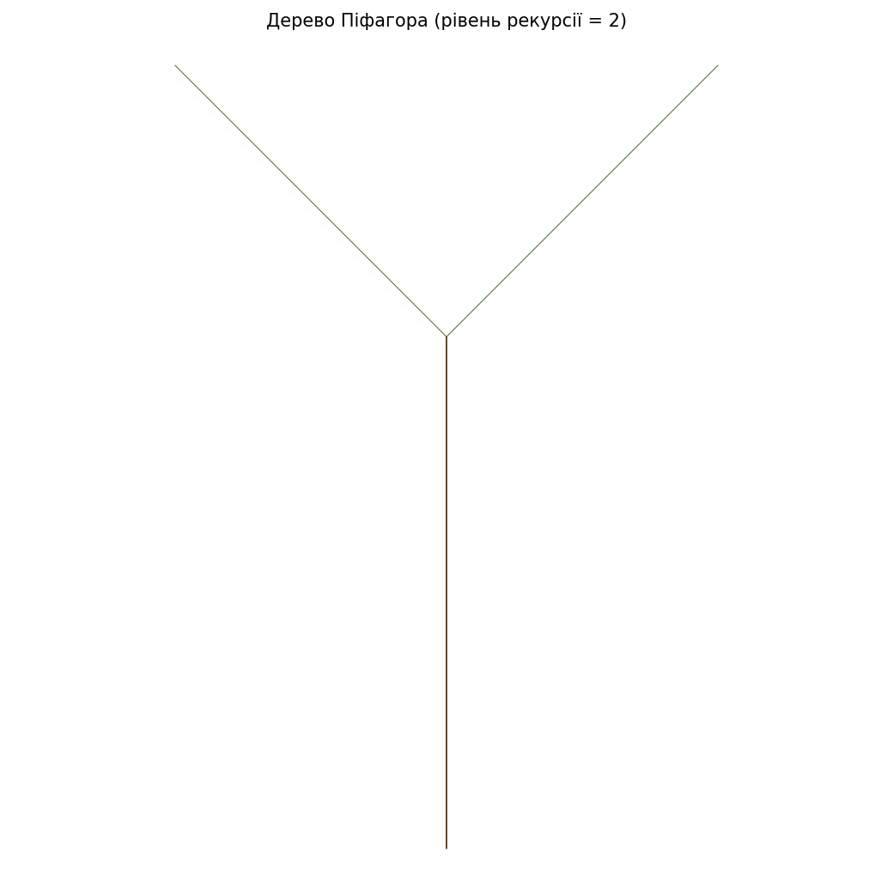
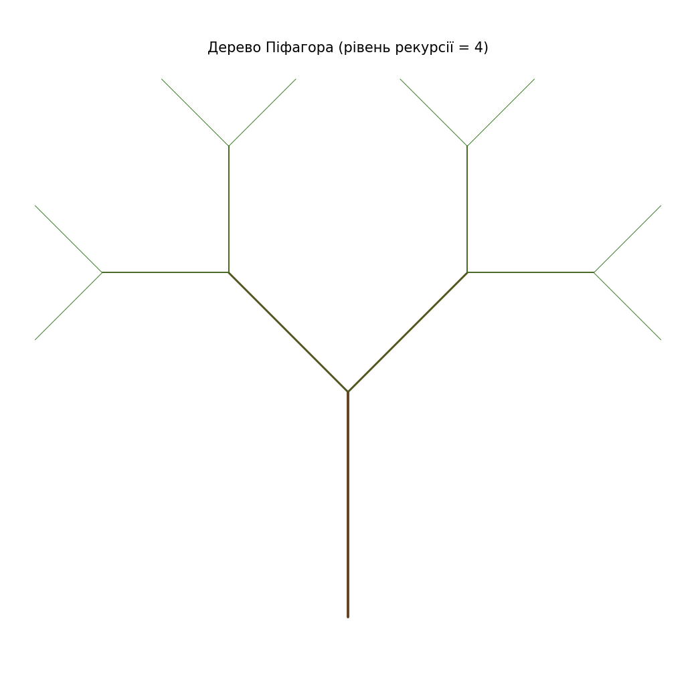
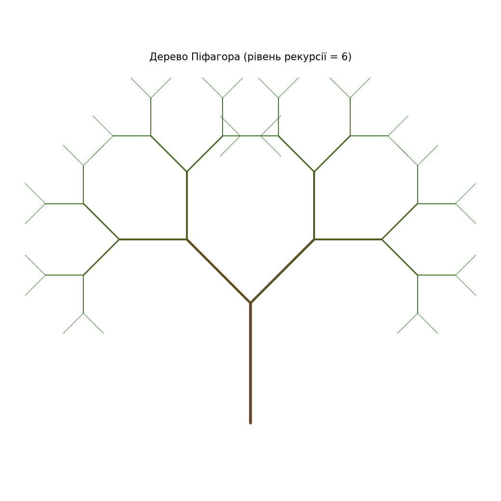
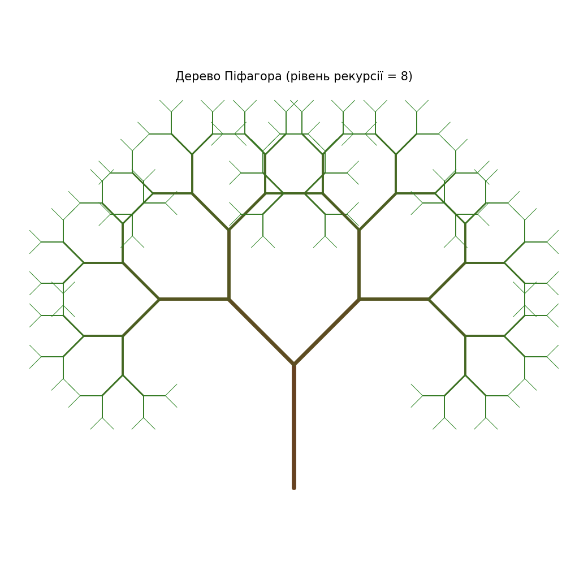

# Завдання 2 — Рекурсія: фрактал «дерево Піфагора»

Рекурсивна побудова дерева Піфагора (гілчастий варіант). Користувач задає рівень
рекурсії; гілки коротшають із кожним рівнем, а колір переходить від коричневого
стовбура до зелених верхівок.

## Запуск

`main.py` імпортує пакет `viz`, тож проєкт потрібно спершу встановити в
editable-режимі (див. [«Запуск» у кореневому README](../README.md#запуск)) —
інакше імпорт дасть помилку `ModuleNotFoundError: No module named 'viz'`:

```bash
pip install -e .
```

**Інтерактивно** (вікно `turtle`, потрібні `tkinter` / графічне середовище):

```bash
python task_2/main.py
```

Програма запитає рівень рекурсії (невід'ємне ціле, рекомендовано 5–12) і
відкриє вікно з деревом.

**У PNG** — через `matplotlib`, без дисплея (саме так зроблено `tree.png`):

```bash
python task_2/main.py --save                 # tree.png, рівень 10
python task_2/main.py --save out.png --level 8
```

`--level` діє лише з `--save`; в інтерактивному режимі рівень береться з підказки.

## Як це працює

Рекурсія лише будує геометрію, а малювання відокремлене:
`pythagoras_segments(order, size)` у `main.py` нічого не малює — вона повертає
список відрізків, який згодом малює рендер.

Дерево росте від стовбура. Старт — базова точка з напрямком `heading = 90°`
(вертикально вгору). Один крок для рівня `order`: від поточної точки
відкладається гілка завдовжки `size` у напрямку `heading`, а її кінець
рахується напряму тригонометрією — `x1 = x + size * cos(heading)`,
`y1 = y + size * sin(heading)`. Цей відрізок `(x, y) → (x1, y1)` додається до
списку разом зі своїм рівнем `order` (за ним рендер обере колір і товщину).
Потім із того самого кінця `(x1, y1)` рекурсивно ростуть дві дочірні гілки:
ліва під кутом `+45°`, права під `−45°`, обидві завдовжки `size * 0.75` і з
рівнем `order - 1`.

Рекурсія спиняється на базовому випадку `order <= 0` (тут нічого не додається).
Умова саме `<=`, а не `==`, страхує від нескінченної рекурсії, якщо рівень
виявиться від'ємним. Оскільки дочірні гілки стартують точно з кінця
батьківської, координати рахуються лише «вперед»: не треба після кожної гілки
повертати курсор назад, як довелося б у покроковому малюванні.

Рендер живе в пакеті `viz` (`viz/pythagoras.py`): `render_turtle` малює відрізки у
вікні turtle, `save_png` — у PNG через matplotlib. Колір гілки залежить від її
рівня. Кількість гілок росте як 2ⁿ − 1, тож на рівнях понад 13 малювання помітно
сповільнюється.

## Результат

З кожним рівнем рекурсії дерево густішає — гілок стає 2ⁿ − 1:

<table>
  <tr>
    <td align="center"><br><sub><b>рівень 2</b> · 3</sub></td>
    <td align="center"><br><sub><b>рівень 4</b> · 15</sub></td>
    <td align="center"><br><sub><b>рівень 6</b> · 63</sub></td>
    <td align="center"><br><sub><b>рівень 8</b> · 255</sub></td>
    <td align="center"><br><sub><b>рівень 10</b> · 1023</sub></td>
  </tr>
</table>

Рівень 10 (`tree.png` — його зберігає `--save` за замовчуванням):


Це гілчастий варіант (лінії); класичне дерево Піфагора будують із квадратів, де
кожен породжує два менші на катетах прямокутного трикутника — звідси й назва.
