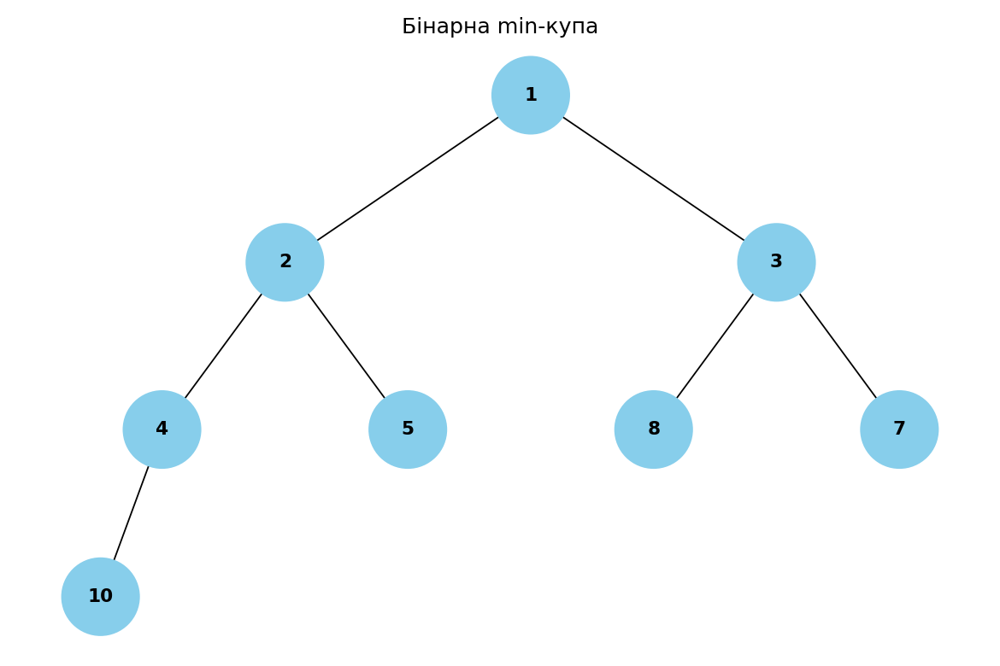

# Завдання 4 — Візуалізація бінарної купи

Купа зберігається масивом: для індексу `i` діти — це `2*i + 1` і `2*i + 2`. За
цим правилом з масиву будується бінарне дерево, яке потім малюється.

## Запуск

`main.py` імпортує пакет `viz`, тож проєкт потрібно спершу встановити в
editable-режимі (див. [«Запуск» у кореневому README](../README.md#запуск)) —
інакше імпорт дасть помилку `ModuleNotFoundError: No module named 'viz'`:

```bash
pip install -e .
```

Потрібні `networkx` і `matplotlib`.

**У вікнах** (потрібне графічне середовище) — відкриються два вікна, min- і
max-купа:

```bash
python task_4/main.py
```

**У PNG** — `--save` пише `min_heap.png` і `max_heap.png` поруч зі скриптом
(backend Agg, без дисплея):

```bash
python task_4/main.py --save
```

## Як це працює

`build_heap_tree(heap, i=0)` рекурсивно створює вузол для індексу `i` й підвішує
до нього піддерева для `2*i + 1` та `2*i + 2`; за межами масиву повертає `None`.
Уся суть — саме в цих індексах: масив-купа однозначно задає форму дерева, окремо
зберігати посилання не треба.

Клас `Node` і `draw_tree` лежать у `viz/binary_tree.py` і спільні із Завданням 5,
тож `main.py` містить лише побудову дерева.

## Результат

Min-купа з `[10, 5, 3, 4, 1, 8, 7, 2]` після `heapq.heapify` стає
`[1, 2, 3, 4, 5, 8, 7, 10]`:



Max-купа з прикладу завдання `[10, 5, 3, 4, 1]`:


В обох випадках корінь — екстремум (мінімум або максимум), і це правило діє
для кожного вузла з його дітьми. Побудова й малювання — O(n): кожен елемент масиву
стає рівно одним вузлом дерева.
