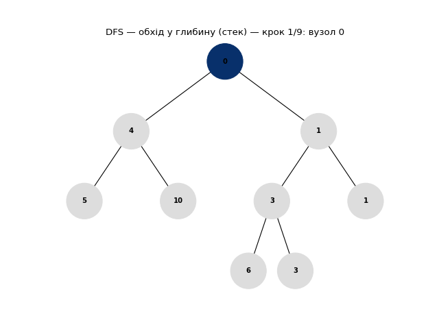

# Завдання 5 — Обходи бінарного дерева (DFS / BFS)

Ітеративні обходи у глибину (стек) і в ширину (черга), без рекурсії. Кожен вузол
при відвідуванні отримує колір градієнтом: темні — відвідані раніше, світлі —
пізніше.

## Запуск

`main.py` імпортує пакет `viz`, тож проєкт потрібно спершу встановити в
editable-режимі (див. [«Запуск» у кореневому README](../README.md#запуск)) —
інакше імпорт дасть помилку `ModuleNotFoundError: No module named 'viz'`:

```bash
pip install -e .
```

Потрібні `networkx` і `matplotlib`.

**У вікнах** (потрібне графічне середовище) — відкриються два вікна, DFS і BFS:

```bash
python task_5/main.py
```

**У PNG** — `--save` пише `dfs.png` і `bfs.png` поруч зі скриптом (backend Agg,
без дисплея):

```bash
python task_5/main.py --save
```

`Node` і `draw_tree` беруться зі спільного `viz/binary_tree.py` — той самий код, що
й у Завданні 4, окремої копії більше немає.

## Як це працює

BFS — це черга з `popleft`, рівень за рівнем, тут усе просто. У DFS на стеку
є одна пастка: щоб порядок був корінь → ліво → право, праву дитину треба класти у
стек раніше за ліву (стек перевертає порядок). Множина `visited` не потрібна — у
дереві немає циклів. Колір кожного вузла задає `generate_hex_color` за його
номером у списку обходу.

## Результат

DFS (стек): `0 → 4 → 5 → 10 → 1 → 3 → 6 → 3 → 1` — спершу весь лівий бік углиб.


BFS (черга): `0 → 4 → 1 → 5 → 10 → 3 → 1 → 6 → 3` — рівнями.


За кольором різниця читається одразу: у DFS темне «стікає» вглиб лівого піддерева,
а у BFS лягає горизонтальними шарами. Обидва обходи — O(n) за часом; у стеку лежить
до O(h) вузлів, черга — до O(w), де h і w — висота й максимальна ширина дерева.

### Анімація

`python task_5/main.py --animate` зберігає `dfs.gif` і `bfs.gif` — вузли
розфарбовуються по одному в порядку обходу (темні → світлі):




