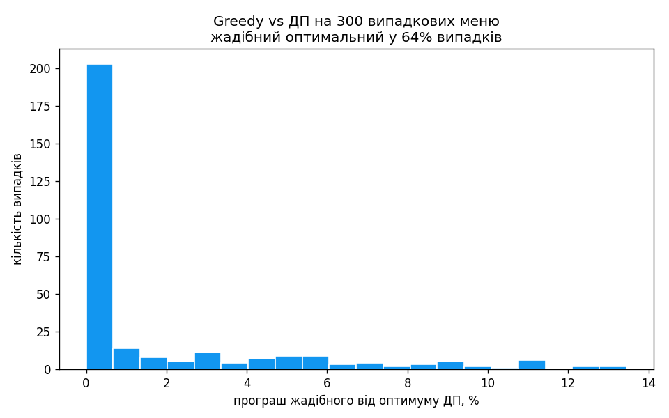

# Завдання 6 — Жадібний алгоритм і динамічне програмування

Вибір страв із максимальною сумарною калорійністю в межах бюджету — класичний
рюкзак 0/1, де кожна страва береться щонайбільше раз.

```python
items = {
    "pizza":     {"cost": 50, "calories": 300},
    "hamburger": {"cost": 40, "calories": 250},
    "hot-dog":   {"cost": 30, "calories": 200},
    "pepsi":     {"cost": 10, "calories": 100},
    "cola":      {"cost": 15, "calories": 220},
    "potato":    {"cost": 25, "calories": 350},
}
```

## Запуск

```bash
python task_6/main.py
```

Лише стандартна бібліотека.

## Підходи

`greedy_algorithm` сортує страви за спаданням відношення калорії/вартість і бере
їх, поки вистачає бюджету; якщо страва не влізла — пропускає її й пробує
наступні, а не зупиняється на першій невдачі, тож устигає добрати дешевші.

`dynamic_programming` — рюкзак 0/1 на 2D-таблиці `dp[i][b]`: максимальна
калорійність для перших `i` страв у межах бюджету `b`. Кожен рядок `i` будується
з попереднього `i-1`, тож страва потрапляє в набір щонайбільше раз — для кожного
`b` береться краще з двох: `dp[i-1][b]` (без страви) або `dp[i-1][b-cost] +
calories` (зі стравою).

## Результат (бюджет 100)

| Підхід | Набір | Вартість | Калорії |
|---|---|---:|---:|
| Жадібний | cola, potato, pepsi, hot-dog | 80 | 870 |
| ДП | pizza, pepsi, cola, potato | 100 | 970 |

Жадібний витрачає лише 80 і набирає 870 ккал: він рано бере дешеві страви з
найкращим відношенням, і на залишок 20 уже нічого дорожчого не влазить. ДП
використовує весь бюджет і знаходить 970 ккал — на сотню більше. Це й є наочна
межа жадібного підходу: швидко, але оптимуму для 0/1 не гарантує.

| | Час | Пам'ять | Оптимум |
|---|---|---|---|
| greedy | O(n log n) | O(n) | ні |
| ДП | O(n · budget) | O(n · budget) | так |

Складність ДП псевдополіноміальна — росте з бюджетом. Сам набір страв
відновлюється зворотним проходом по таблиці: страву `i` взято, якщо `dp[i][b]`
кращий за `dp[i-1][b]`. Ціна цього — пам'ять O(n · budget) на 2D-таблицю; якщо
потрібна лише максимальна калорійність (без переліку страв), вистачає одного
рядка — це реалізує `dynamic_programming_value` (O(budget) пам'яті). Для
фіксованого меню й помірного бюджету ДП — правильний вибір; жадібний доречний,
коли потрібна миттєва відповідь і похибка прийнятна.

### Бенчмарк

`python task_6/main.py --bench` зберігає `knapsack_compare.png` — програш жадібного
від оптимуму ДП на 300 випадкових меню (потрібен `matplotlib`). Жадібний
оптимальний приблизно у 64% випадків, але подекуди відстає на ~10–14% — наочна
ціна швидкості.


